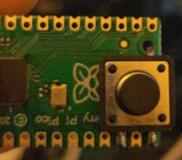
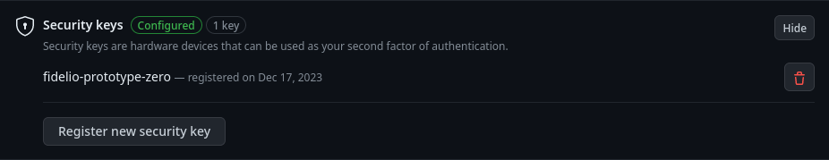

# Fidelio

## Turn a rp2040 into a personal authentication key

Universal 2FA using Raspberry Pi Pico (rp2040) and wolfCrypt. Works with any
raspberry-pi pico device with only one component added (pushbutton on GPIO15).

### Goals and security model

Fidelio implements a U2F/Fido security key, generally used as second factor in
2FA services, or in some specific cases for password-less authentication.

Associating a 2FA authentication service to a hardware key as second factor will
require the user to provide the key to prove that they are still in possess of
the hardware key that was initially registered.

The holder of the key can only prove the physical presence of the key during an
authentication procedure. This is done by connecting it via USB and pushing a button.

Through this mechanism, the U2F/Fido1.2 authenticator is given a proof that the
request has been processed (signed) by the same key initially registeded , so the
user can be trusted as the authenticator assumes that the user is still holding
the key.

Two-factor authentication based on U2F mechanism is generally considered more secure than time-based
OTP services, like mobile apps or other devices that require clock synchronization with the
authenticating party.

The device creates a unique private key, which is then used to derive the keys for the
authenticating services requesting a U2F authentication. This means that Fidelio does
not pose any storage limitation on the number of authentication services that can be
registered, as the same key is derived again whenever needed and it's never stored on
the device.

The codebase is simple and rather small, allowing for an easy full audit of the security
model and the related implementations.


### Security considerations

The security of Fidelio, like those of all other similar hw-based U2F devices, depends
entirely on the physical presence of the hardware. If Fidelio is lost or stolen, the second factor of
all the registered services must be considered as compromised, and the keys associated to the device should be
revoked from all the associated services. This usually does not represent an important security risk in itself,
as long as a first factor is in use (commonly, password authentication).

A rp2040 board running Fidelio will not store any credentials or traces that can be associated
with any running server. The only two pieces of information stored in the target's FLASH memory
are the device's master key, generated on first use, and a counter keeping track
of the number of crypto operation done throughout the lifetime of the device, as
mandated by the U2F-Fido protocol.

### Hardware requirements

U2F-Fido1.2 protocol mandates the use of a single button to indicate that the user
is actually present when the key is used.

For this purpose, Fidelio requires to add a push-button between GPIO15 and GND.

On the Raspberry-pi pico board, this button can normally be soldered in place:




If you are using a different model and/or you want to change the pin for the U2F
presence button and LED, just edit [pins.h](src/pins.h) and change the pin number
defined by the macro `PRESENCE_BUTTON` and `U2F_LED`, respectively.


### How to build:

1. Clone this repository, create and populate build directory

```
git clone https://github.com/danielinux/fidelio.git
cd fidelio
git submodule update --init --single-branch pico-sdk lib/wolfssl
cd pico-sdk
git submodule update --init --single-branch lib/tinyusb
cd ..

```

2. Create your own attestation certificate.
This is required only once. The certificate generate will univocally identify your
device.

You may change/customize the details in the certificate by editing the `mkcert.sh`
script.

```
./mkcert.sh
```

3. Execute cmake to create the build directory. Ensure to pass the full absolute
path to the pico-sdk directory.

```
cmake -B build -DPICO_COPY_TO_RAM=1 -DFAMILY=rp2040 -DPICO_SDK_PATH=/path/to/fidelio/pico-sdk
```


4. Compile
```
cd build
make
```

4. Upload to raspberry pi pico:
```
cp fidelio.uf2 /path/to/RPI-RP2

```


### First run: generating the master key

The first time the device is plugged in into the computer, it will randomly generate its master key.
The master key will be then used, for the entire lifetime of the device, to generate
keys for single U2F services.

Updating the Fidelio firmware to a newer version will not overwrite the master key,
so the key will keep working with services that had been registered with the old
firmware as well.


### Testing

#### Online services

To ensure that your device is correctly working, connect Fidelio to your PC and
visit the demo website provided by Yubico:

https://demo.yubico.com/webauthn-technical/registration

### Usage

#### Service example: github second factor

Go to your profile settings. Select "Password and authentication" from the Access menu.

Find the "Two factor authentication" configuration at the bottom of the page. Check the
"Security Keys" option:


The button "Register new security key" will associate the device running fidelio
as a second factor to access your github account. Give it a unique name of your
choice.



It is a good idea to configure more than one 2FA mechanism to your account to
avoid the risk of being locked out of your account. This of course includes the
possibility to use more than one fidelio hardware keys, stored in different places.

#### Local PAM services

To test on a linux machine, install `libpam-u2f` and `pamu2fcfg`.

With the command `pamu2fcfg` you can register a new key associated to your device.
See `man pamu2fcfg` for information about command line options.

The package `libpam-u2f` provides a module for PAM. Keys created with pamu2fcfg
can be used as extra (or sole) authentication step for any pam service in `/etc/pam.d`.

It is possible for example to configure password-less login, `sudo`, or other
operations by setting the u2f module as `sufficient` in the corresponding pam.d
file, or as extra authentication step, if the keyword `required` is used, instead.

For more information about configuring your services to use libpam-u2f, see the
libpam-u2f documentation (available via `man pam_u2f`).

**Ensure you always keep a root console open when changing pam.d configuration, and
to test your changes properly after each change, to avoid locking yourself out of
your machine**

