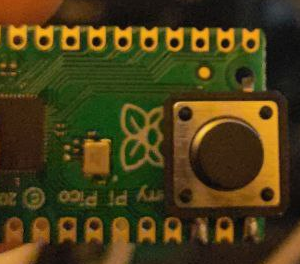
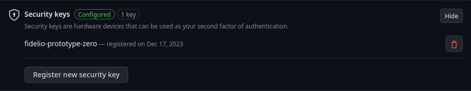

# Fidelio

## Turn a rp2040 into a personal authentication key

Universal FIDO2/U2F key using Raspberry Pi Pico (rp2040) and wolfCrypt. Works with
any raspberry-pi pico device with only one component added (pushbutton on GPIO15).

### Goals and security model

Fidelio implements a FIDO2 authenticator (CTAP2/WebAuthn) with CTAP1/U2F
compatibility, generally used as second factor in 2FA services, or in some
specific cases for password-less authentication.

Associating a 2FA authentication service to a hardware key as second factor will
require the user to provide the key to prove that they are still in possess of
the hardware key that was initially registered.

The holder of the key can only prove the physical presence of the key during an
authentication procedure. This is done by connecting it via USB and pushing a button.

Through this mechanism, the authenticator is given a proof that the
request has been processed (signed) by the same key initially registered, so the
user can be trusted as the authenticator assumes that the user is still holding
the key.

Two-factor authentication based on FIDO mechanisms is generally considered more secure than time-based
OTP services, like mobile apps or other devices that require clock synchronization with the
authenticating party.

The device creates a unique private key, which is then used to derive the keys for the
authenticating services requesting a FIDO authentication. This means that Fidelio does
not pose any storage limitation on the number of authentication services that can be
registered, as the same key is derived again whenever needed and it's never stored on
the device. CTAP1/U2F remains supported for legacy services; CTAP2/WebAuthn is the
primary protocol.

The codebase is simple and rather small, allowing for an easy full audit of the security
model and the related implementations.


### Security considerations

The security of Fidelio depends entirely on the physical presence of the hardware. If Fidelio is lost
or stolen, the second factor of all the registered services must be considered compromised, and the
keys associated to the device should be revoked from all the associated services. This usually does
not represent an important security risk in itself, as long as a first factor is in use (commonly,
password authentication).

A rp2040 board running Fidelio will not store any credentials or traces that can be associated
with any running server.

**The master key is never stored.** It is reconstructed at every boot from the power-on state of
a reserved block of SRAM — an SRAM PUF (Physically Unclonable Function) — using the wolfCrypt
BCH(127,64,t=10) fuzzy extractor. What FLASH holds is only the *checkpoint*: non-secret helper
data that corrects the bit errors in each boot's reading, plus a salt. Neither reveals the key.
Dumping the FLASH of a Fidelio device therefore does not yield anything that can be used to
impersonate it; the key exists only in RAM, only while the device is powered.

The other information kept in FLASH is the counters tracking crypto operations, as mandated by
the FIDO protocols, the FIDO2 PIN hash, and any resident credentials.

Because the key is a property of the individual chip, a Fidelio image cannot be cloned onto
another board to duplicate a key: flashing the same firmware elsewhere produces a different
device.

### Hardware requirements

FIDO/U2F mandates the use of a single button to indicate that the user is
actually present when the key is used. Without this button the authenticator
will never assert user presence.

For this purpose, Fidelio requires a normally-open push-button between GPIO15
and GND.

On the Raspberry-pi pico board, this button can normally be soldered in place:




If you are using a different model and/or you want to change the pin for the
presence button and LED, just edit [pins.h](src/pins.h) and change the pin number
defined by the macro `PRESENCE_BUTTON` and `U2F_LED`, respectively.


### Build and flash:

1. Clone this repository, create and populate build directory

```
git clone https://github.com/danielinux/fidelio.git
cd fidelio
git submodule update --init --single-branch pico-sdk lib/wolfssl
cd pico-sdk
git submodule update --init --single-branch lib/tinyusb
cd ..

```

2. Create your own attestation certificate.
This is required only once. The certificate generate will univocally identify your
device.

You may change/customize the details in the certificate by editing the `mkcert.sh`
script.

```
./mkcert.sh
```

3. Configure CMake (pass the full absolute path to pico-sdk):

```
cmake -B build -DPICO_COPY_TO_RAM=1 -DFAMILY=rp2040 -DPICO_SDK_PATH=/path/to/fidelio/pico-sdk
```

4. Compile:

```
cmake --build build
```

5. Flash to the Pico (hold BOOTSEL when plugging in, then copy):

```
cp build/fidelio.uf2 /path/to/RPI-RP2
```


### First run: enrolling the SRAM PUF

The first time the device is plugged in, it enrolls its SRAM PUF. This takes two boots:

1. **Enrollment.** The device measures the power-on state of its reserved SRAM block, computes
   the helper data, writes it to FLASH as *provisional*, and then blinks the LED slowly
   (0.7 s on, 0.3 s off) and stops. It does not enumerate over USB in this state.
2. **Verification.** Unplug and plug the device back in. A real power cycle is required — a
   reset would leave SRAM holding its previous contents and prove nothing. The device now
   reconstructs the key from the helper data. If it matches, the checkpoint is marked
   *committed* and the device starts normally. If it does not, the attempt is discarded and
   enrollment starts over.

Nothing is registered against the device until it reaches the committed state, so a board that
fails verification costs nothing.

From then on, every boot reconstructs the same master key, which is used for the entire lifetime
of the device to derive the keys for individual FIDO services.

Updating the Fidelio firmware to a newer version does not touch the checkpoint, so the key keeps
working with services registered under the old firmware.

**If the LED blinks rapidly (0.1 s on, 0.1 s off) the device has failed to reconstruct its key**
and will refuse to perform any cryptographic operation. This is deliberate: silently
re-enrolling would mint a different master key and invalidate every credential without warning.
See "Qualifying a board" below.

### Qualifying a board

The fuzzy extractor corrects at most 10 flipped bits per 127-bit codeword. A typical SRAM PUF
sits comfortably inside that, but the margin narrows at temperature extremes and varies between
chips. Before registering credentials against a new board, check it:

```
cmake -B build-diag -DPICO_COPY_TO_RAM=1 -DFAMILY=rp2040 \
      -DPICO_SDK_PATH=/path/to/fidelio/pico-sdk -DFIDELIO_PUF_DIAG=ON
cmake --build build-diag
cp build-diag/fidelio.uf2 /path/to/RPI-RP2
```

The diagnostic prints a report on UART0 (GP0/GP1, 115200 8N1) instead of acting as an
authenticator. Power-cycle it a dozen or so times, across the temperature range the key will
actually see, and check that reconstruction succeeds every time and that the Hamming weight of
the raw response stays near 50%. A response that is nearly all zeros or all ones means the
region carries no entropy on that board.

**Do not leave a diagnostic build flashed** — it is not an authenticator.

### Set the FIDO2 PIN

After flashing, set the authenticator PIN:

```
fido2-token -S /dev/hidrawX    # enter your chosen PIN when prompted
```

Replace `/dev/hidrawX` with the device path listed by `fido2-token -L`. Press the
presence button when prompted during this flow.

### Factory reset

Hold the presence button while plugging the device in and keep it held for 10 seconds. The LED
turns yellow while the state is wiped: the PUF checkpoint, the operation counters, the PIN and
any resident credentials. The device then reboots into enrollment and needs the two-boot
sequence described above.

This **permanently invalidates every credential** ever registered with the device. Re-enrollment
draws a fresh salt, so the new master key is unrelated to the old one even though it comes from
the same silicon. There is no way to recover the previous key — revoke the device at every
service that still has it registered.

### Testing

#### Online services

To ensure that your device is correctly working, connect Fidelio to your PC and
visit the WebAuthn.io demo: https://webauthn.io/

Use “Register” to create a credential (press the presence button when asked, and
enter the PIN you set above), then “Login” to exercise getAssertion.

### Usage

#### Service example: github second factor

Go to your profile settings. Select "Password and authentication" from the Access menu.

Find the "Two factor authentication" configuration at the bottom of the page. Check the
"Security Keys" option:


The button "Register new security key" will associate the device running fidelio
as a second factor to access your github account. Give it a unique name of your
choice.



It is a good idea to configure more than one 2FA mechanism to your account to
avoid the risk of being locked out of your account. This of course includes the
possibility to use more than one fidelio hardware keys, stored in different places.

#### Local PAM services

To test on a linux machine install `libpam-u2f` and `pamu2fcfg`. Run
`pamu2fcfg -u $USER > ~/.config/Yubico/u2f_keys` (create the directory if needed)
and press the presence button when prompted. Add a line such as
`auth sufficient pam_u2f.so authfile=/home/%u/.config/Yubico/u2f_keys cue`
to the relevant file in `/etc/pam.d` (e.g. `sudo`, `login`) to allow U2F
assertions as password-less auth or as a second factor; see `man pamu2fcfg`
and `man pam_u2f` for options and multiple-key setups.

For CTAP2/FIDO2 flows install `fido2-tools` and `libpam-fido2`. Confirm detection
with `fido2-token -L`, then create a resident PAM credential with
`fido2-cred -M -h pam://$(hostname) -i $USER > ~/.fido2-cred`. Add
`auth sufficient pam_fido2.so authfile=/home/%u/.fido2-cred rp_id=$(hostname)`
to the same `/etc/pam.d` service to use the key for FIDO2 password-less login;
see `man pam_fido2` for tuning user verification, PIN prompts, and per-service
`rp_id` values (e.g. matching SSH `TrustedUserCAKeys` hostnames).

**Ensure you always keep a root console open when changing pam.d configuration, and
test your changes properly after each change to avoid locking yourself out of
your machine**
